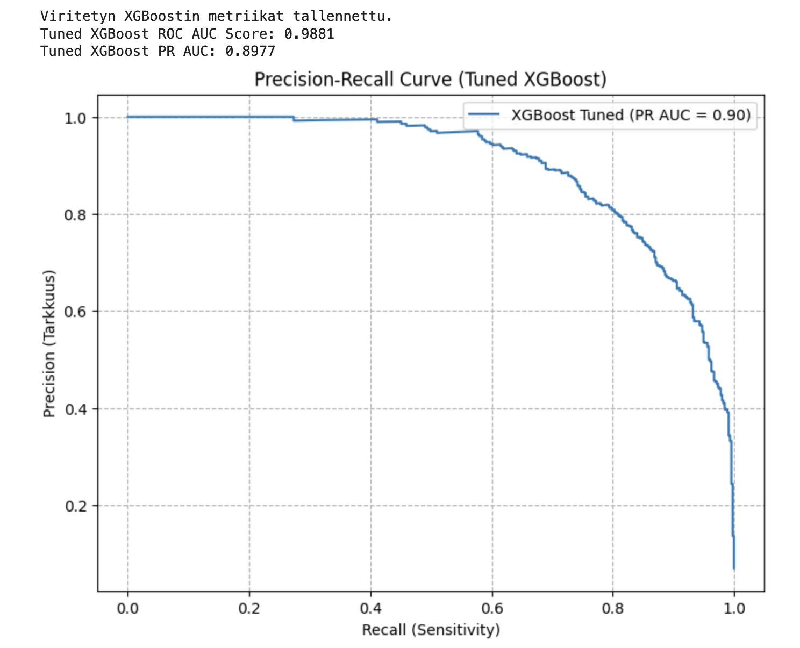
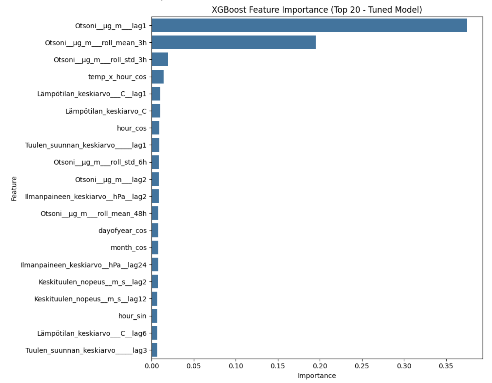

## Helsingin ilmanlaadun analysointi ja otsonipiikkien ennustaminen

Tämä projekti keskittyy Helsingin kaupunki-ilmanlaadun analysointiin, erityisesti korkeiden maanpinnan otsonipitoisuuksien ([O₃]) eli "otsonipiikkien" ennustamiseen. Tavoitteena on tutkia sääolosuhteiden (lämpötila, tuulen nopeus, 
ilmanpaine) vaikutusta otsonitasoihin ja kehittää sekä arvioida erilaisia aikasarja- ja koneoppimismalleja piikkien ennustamiseksi. Tarkat ennusteet ovat tärkeitä kansanterveydellisten varoitusten antamiseksi ja 
päästövähennysstrategioiden tehokkuuden arvioimiseksi.

Projektissa hyödynnetään Ilmatieteen laitoksen avointa dataa Helsingin Kallio 2 (otsoni) ja Kaisaniemi (sää) mittausasemilta noin aikaväliltä 1.4.2020 - 1.4.2025.

## Sisällys

* [Datalähteet](#datalähteet)
* [Projektin rakenne](#projektin-rakenne)
* [Asennus ja käyttöönotto](#asennus-ja-käyttöönotto)
* [Käyttö](#käyttö)
* [Metodologia](#metodologia)
* [Tulokset ja nykytila](#tulokset-ja-nykytila)
* [Seuraavat askeleet](#seuraavat-askeleet)

## Datalähteet

Projektissa käytetty data on peräisin Ilmatieteen laitoksen avoimen datan rajapinnasta ja ladattu tässä repositoriossa olevaan `/data/raw/`-kansioon.

1.  **Helsinki Kallio 2 (Otsoni):** Ilmanlaadun mittausaseman data (`Helsinki Kallio 2_... .csv`). Tästä datasta käytetään pääasiassa `Otsoni [µg/m³]` -aikasarjaa.
2.  **Helsinki Kaisaniemi (Sää):** Säähavaintoaseman data (`Helsinki Kaisaniemi_... .csv`). Tästä datasta käytetään ennustavia muuttujia: `Lämpötilan keskiarvo [°C]`, `Keskituulen nopeus [m/s]`, `Ilmanpaineen keskiarvo [hPa]` ja 
`Tuulen suunnan keskiarvo [°]`.

Aikaväli molemmille datoille on noin **1.4.2020 - 1.4.2025**.

Tähän asti käytetty data:

* `Helsinki Kallio 2_ 1.4.2020 - 1.4.2025_... .csv`
* `Helsinki Kaisaniemi_ 1.4.2020 - 1.4.2025_... .csv`


Löytyy dataa myös pidemmältä ajalta:

* `Helsinki Kallio 2_ 1.1.2013 - 31.12.2024_... .csv`  
* `Helsinki Kaisaniemi_ 1.1.2013 - 31.12..2024_... .csv`


## Tietolähteet (Esimerkkejä / Tutkittavia)

* **Ilmatieteen laitos (FMI):** Avoimen datan rajapinnat tarjoavat historiallista säädataa ja ilmanlaatuhavaintoja.
    * [FMI Avoin Data](https://ilmatieteenlaitos.fi/avoin-data)
	* [FMI havaintojen lataus](https://www.ilmatieteenlaitos.fi/havaintojen-lataus)


* **Helsingin seudun ympäristöpalvelut (HSY):** Tarjoaa tietoa pääkaupunkiseudun ilmanlaadusta ja mittausasemien dataa.
    * [HSY Ilmanlaatu](https://www.hsy.fi/ilmanlaatu-ja-ilmasto/ilmanlaatu/)
      * [Ilmanlaatu PK-seudulla](https://www.hsy.fi/ilmanlaatu-ja-ilmasto/ilmanlaatu-paakaupunkiseutu/ilmansaasteiden-pitoisuudet/)
	* [HSY avoin data](https://www.hsy.fi/ymparistotieto/avoindata/avoin-data---sivut/paakaupunkiseudun-ilmansaastepitoisuudet/)

* **Fintraffic / Digitraffic:** Mahdollisesti liikennedataa.
    * [Digitraffic](https://www.digitraffic.fi/)

*(Tarkemmat datan URL-osoitteet ja kuvaukset lisätään projektin edetessä.)*

## Projektin Rakenne

Tässä on projektin hakemistorakenne:

```text
/ilmanlaatu-ennuste-helsinki/
│
├── data/
│   ├── raw/              # Alkuperäiset raakadatatiedostot (CSV, XLSX)
│   └── processed/        # (Valinnainen) Puhdistetut, yhdistetyt, resamplatut datat
│
├── images/               # Tallennetut visualisointikuvat README:tä varten
│   ├── model_comparison_bars.png
│   ├── xgboost_tuned_pr_curve.png
│   └── xgboost_tuned_feature_importance.png
│
├── notebooks/            # Jupyter/Colab Notebookit analyysia ja mallinnusta varten
│   ├── EDA_Kallio_Otsoni.ipynb
│   ├── EDA_Kaisaniemi_Sää.ipynb
│   ├── Mallinnus_ARIMA_SARIMA.ipynb
│   ├── Mallinnus_SARIMAX.ipynb
│   ├── Mallinnus_LogReg_XGB_LGBM_Vertailu.ipynb # Yhdistetty vertailuajo
│   ├── Mallinnus_XGBoost_Viritys.ipynb       # XGBoostin viritys
│   └── ...(Tulevat LSTM/RNN-mallit)...
│
├── scripts/              # (Valinnainen) Python-skriptit
│
├── requirements.txt      # Projektin vaatimat Python-kirjastot
└── README.md             # Tämä tiedosto

```

## Asennus

1.  Kloonaa repositorio:
    ```bash
    git clone https://github.com/rrwiren/ilmanlaatu-ennuste-helsinki
    cd ilmanlaatu-ennuste-helsinki
    ```
2.  (Suositus) Luo virtuaaliympäristö:
    ```bash
    python -m venv venv
    source venv/bin/activate  # Linux/macOS
    # venv\Scripts\activate  # Windows
    ```
3.  Asenna riippuvuudet:
    ```bash
    pip install -r requirements.txt
    ```

**Tärkeimmät kirjastot (lisää `requirements.txt`-tiedostoon):**

* pandas
* numpy
* requests
* matplotlib
* seaborn
* statsmodels
* scikit-learn
* xgboost
* lightgbm
* *(Lisää tensorflow/pytorch, jos/kun käytät LSTM/RNN-malleja)*

*(Luo `requirements.txt`-tiedosto komennolla `pip freeze > requirements.txt` kun olet asentanut tarvittavat kirjastot)*

## Käyttö

Analyysi ja mallinnus on tehty pääasiassa Jupyter Notebookeissa (`/notebooks`-kansio).

1.  Avaa haluamasi notebook (esim. ` .ipynb`) Jupyter Notebookissa, JupyterLabissa tai Google Colabissa.
2.  Suorita solut järjestyksessä. Notebookit sisältävät datan latauksen, esikäsittelyn, analyysin, mallinnuksen ja visualisoinnin vaiheet.


## Asennus ja käyttöönotto

Projekti käyttää Python 3 -versiota ja useita datatieteen kirjastoja. Suositeltava tapa on luoda virtuaaliympäristö.

1.  **Kloonaa repositorio:**
    ```bash
    git clone [https://github.com/rrwiren/ilmanlaatu-ennuste-helsinki.git](https://github.com/rrwiren/ilmanlaatu-ennuste-helsinki.git)
    cd ilmanlaatu-ennuste-helsinki
    ```
2.  **(Suositus) Luo ja aktivoi virtuaaliympäristö:**
    ```bash
    python3 -m venv venv
    source venv/bin/activate  # Linux/macOS
    # venv\Scripts\activate  # Windows PowerShell
    # .\venv\Scripts\activate.bat # Windows Cmd
    ```
3.  **Asenna vaaditut kirjastot:**
    ```bash
    pip install -r requirements.txt
    ```

**Tärkeimmät kirjastot (`requirements.txt`):**

* pandas
* numpy
* requests
* matplotlib
* seaborn
* statsmodels
* scikit-learn
* xgboost
* lightgbm
* *(Lisää tensorflow/pytorch, jos/kun käytät LSTM/RNN-malleja)*

*(Muista luoda/päivittää `requirements.txt`-tiedosto: `pip freeze > requirements.txt`)*

## Käyttö

Analyysi ja mallinnus on toteutettu Jupyter Notebookeissa (`/notebooks`-kansio).

1.  Käynnistä Jupyter Notebook tai JupyterLab aktiivisessa virtuaaliympäristössäsi tai avaa notebookit Google Colaboratoryssa.
2.  Avaa haluamasi notebook (esim. `Mallinnus_LogReg_XGB_LGBM_Vertailu.ipynb`).
3.  Suorita solut järjestyksessä. Notebookit sisältävät vaiheet datan latauksesta mallien evaluointiin ja visualisointiin.

## Metodologia

Projekti etenee karkeasti CRISP-DM-mallin mukaisesti:

1.  **Datan ymmärtäminen:** Tutustuminen Kallion otsoni- ja Kaisaniemen säädataan. Eksploratiivinen data-analyysi (EDA) trendien, kausivaihteluiden, jakaumien ja muuttujien välisten korrelaatioiden tunnistamiseksi.
2.  **Datan valmistelu:**
    * Tiedostojen lukeminen ja peruspuhdistus (oikeat koodaukset, desimaalierottimet).
    * Aikaleimojen luonti ja asettaminen indeksiksi.
    * Otsoni- ja säädatan yhdistäminen aikaleiman perusteella (`inner join`).
    * Datan uudelleenotanta (`resample`) säännölliseen tuntitaajuuteen ('h') ja syntyneiden aukkojen täyttäminen interpoloimalla (`interpolate(method='time')`).
    * Otsonipiikkien määrittely binääriseksi kohdemuuttujaksi (`onko_piikki`) käyttäen 90. persentiilin kynnysarvoa.
    * Laajan piirrejoukon luonti (Feature Engineering):
        * Aika-piirteet (tunti, viikonpäivä, kuukausi, vuodenpäivä) syklisesti koodattuna (sin/cos).
        * Viiveistetyt arvot (lags 1-72h) otsonille ja säämuuttujille.
        * Liukuvat tilastot (keskiarvo, keskihajonta) otsonille ja osittain säämuuttujille (3-48h ikkunat).
        * Yhteisvaikutuspiirteet (esim. lämpötila * kellonaika).
    * Piirteiden nimien puhdistus (erikoismerkkien poisto).
    * Datan jako opetus- ja testijoukkoihin ajallisesti (viimeiset 15% testaukseen).
    * Piirteiden skaalaus (`StandardScaler`).
3.  **Mallinnus:** Eri mallien kokeilu piikkien ennustamiseen:
    * **Aikasarjamallit:** ARIMA, SARIMA, SARIMAX (osoittautuivat haastaviksi piikkien ennustamisessa tällä datalla/esikäsittelyllä).
    * **Koneoppimismallit (Luokittelu):**
        * Logistinen Regressio (perusmalli).
        * XGBoost (oletusparametreilla ja hyperparametreilla viritettynä).
        * LightGBM (oletusparametreilla).
        * **Suunnitteilla:** LSTM, RNN.
4.  **Evaluointi:** Luokittelumallien arviointi käyttäen:
    * Classification Report (Precision, Recall, F1-score erityisesti piikki-luokalle).
    * Confusion Matrix.
    * ROC AUC.
    * Precision-Recall AUC (erityisen relevantti epätasapainoiselle datalle).

## Tulokset ja nykytila

### Tulosten vertailu: Oletus vs. Viritetty XGBoost

Hyperparametrien viritys ajoi onnistuneesti läpi (~13 min Colabissa). Alla oleva taulukko vertaa viritetyn XGBoost-mallin (`v9`) suorituskykyä aiempaan oletusparametreilla ajettuun versioon (`v4`) testidatalla:

| Metriikka           | XGBoost (Oletus, v4) | XGBoost (Viritetty, v9) | Muutos          | Tulkinta                                                                 |
| :------------------ | :------------------- | :---------------------- | :-------------- | :----------------------------------------------------------------------- |
| Accuracy            | 0.9607               | 0.9720                  | +0.0113         | Kokonaistarkkuus parani hieman.                                          |
| **Precision (Spike)** | 0.6628               | **0.7886** | **+0.1258** | **Merkittävä parannus!** Viritetyn mallin piikkiennusteet ovat paljon useammin oikeita. |
| **Recall (Spike)** | **0.8862** | 0.8162                  | **-0.0700** | Lasku. Viritetty malli löytää vähemmän kaikista todellisista piikeistä.     |
| **F1-score (Spike)** | 0.7584               | **0.8022** | **+0.0438** | **Selvä parannus.** Precisionin nousu kompensoi Recallin laskun.           |
| ROC AUC             | 0.9881               | 0.9881                  | 0.0000          | Yleinen erottelukyky pysyi erinomaisena.                                 |
| PR AUC              | **0.8998** | 0.8977                  | -0.0021         | Pieni lasku, käytännössä sama. Kertoo hyvästä suorituskyvystä epätasapainossa. |

**Johtopäätökset parannuksista:**

* **Onnistunut viritys:** Hyperparametrien viritys oli ehdottomasti hyödyllistä!
* **Precisionin merkittävä kasvu:** Suurin parannus nähtiin Precisionissa piikeille. Tämä tarkoittaa, että kun viritetty malli ennustaa piikin, voit olla huomattavasti varmempi sen oikeellisuudesta kuin oletusmallilla.
* **Recallin kustannuksella:** Parantunut Precision tuli kuitenkin Recallin kustannuksella. Malli on nyt "varovaisempi" ennustamaan piikkejä, joten se löytää niistä hieman pienemmän osan kuin aiemmin.
* **Parempi tasapaino (F1):** F1-score, joka mittaa Precisionin ja Recallin tasapainoa, parani selvästi. Tämä viittaa siihen, että kokonaisuutena viritetty malli on parempi kompromissi piikkien tunnistamisessa.
* **PR AUC:** Pieni lasku PR AUC:ssa voi johtua siitä, että optimoimme F1-scorea ristiinvalidioinnissa, ja se painotti Precisionia hieman enemmän Recallin kustannuksella tässä tapauksessa.

---

* **EDA:** Tunnistettu selkeät vuorokausi- ja vuosittaiset syklit otsonipitoisuuksissa. Säämuuttujilla havaittu odotettuja korrelaatioita.
* **SARIMAX:** Vaikka datan uudelleenotanta mahdollisti mallien ajamisen ilman NaN-ennusteita, niiden ennustustarkkuus jäi heikoksi, eivätkä ne tunnistaneet piikkejä.
* **ML-luokittelijat (Yhteenveto):**
    * **Gradient Boosting -mallit (XGBoost, LightGBM) suoriutuivat selvästi parhaiten** piikkien ennustamisessa verrattuna Logistiseen Regressioon ja SARIMAX-malleihin.
    * **Hyperparametreilla viritetty XGBoost** antoi parhaan F1-scoren ja Precisionin piikeille, mutta hieman matalamman Recallin kuin oletusmallit.
    * **Kaikkien testattujen ML-mallien vertailutaulukko (Testidata):**

        | Malli                  |   Accuracy |   Precision (Spike) |   Recall (Spike) |   F1-score (Spike) |   ROC AUC |   PR AUC |
        |:-----------------------|-----------:|--------------------:|-----------------:|-------------------:|----------:|---------:|
        | **XGBoost (Tuned)** | **0.9720** |          **0.7886** |           0.8162 |         **0.8022** |    0.9881 |   0.8977 |
        | LightGBM (Default)     |     0.9631 |              0.6807 |           0.8862 |             0.77   |    0.9881 |   0.8975 |
        | XGBoost (Default)      |     0.9607 |              0.6628 |           0.8862 |             0.7584 |    0.9881 |   0.8998 |
        | Logistic Regression    |     0.9470 |              0.5726 |           0.9409 |             0.7119 |    0.9877 |   0.8849 |

    * **Visualisointeja (Viritetty XGBoost):** *(Varmista, että polut ja tiedostonimet ovat oikein repositoriossasi)*

        * **Mallien vertailu (pylväskaavio):**
          
        * **Precision-Recall -käyrä (Viritetty XGBoost):**
          
        * **Tärkeimmät piirteet (Viritetty XGBoost):**
          

* **Nykytila:** Viritetty XGBoost on tähän mennessä paras malli otsonipiikkien ennustamiseen tässä projektissa. Laaja piirrejoukko, joka sisältää viiveistettyjä arvoja, aika-piirteitä ja liukuvia tilastoja, osoittautui 
hyödylliseksi. Erityisesti edellisten tuntien otsonipitoisuudet ja niiden vaihtelu ovat tärkeitä ennustajia.

## Seuraavat askeleet

* **LSTM/RNN-mallien kokeilu:** Tutkia, pystyvätkö rekurrentit neuroverkot oppimaan aikariippuvuuksia eri tavalla ja saavuttamaan parempia tuloksia.
* **LightGBM:n viritys:** Voisiko LightGBM:n suorituskykyä parantaa hyperparametrien virityksellä XGBoostin tasolle tai jopa paremmaksi?
* **Piirteiden valinta/karsinta:** Analysoida tarkemmin piirteiden tärkeyttä ja kokeilla poistaa vähemmän tärkeitä piirteitä mallien yksinkertaistamiseksi.
* **Luokittelukynnysarvon optimointi:** Säätää todennäköisyyskynnystä parhaan Precision/Recall-tasapainon löytämiseksi viritetylle XGBoost-mallille.


## Kontribuutio

Tämä on henkilökohtainen harjoitusprojekti. Ehdotukset ja kommentit ovat tervetulleita, kiitos.

