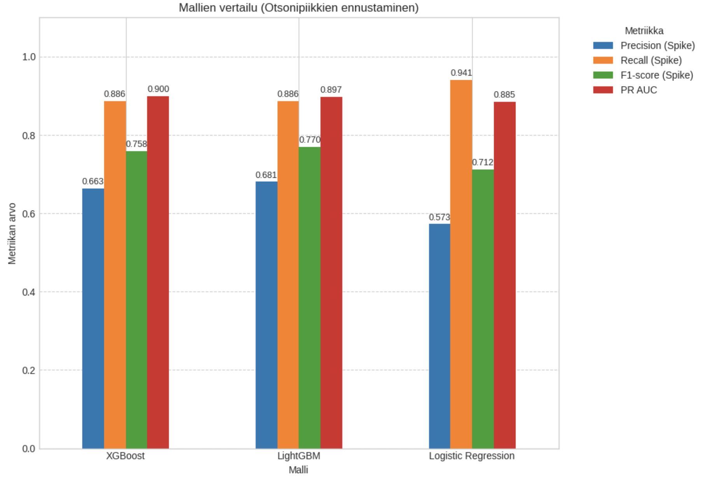

'# Ilmanlaadun ennustaminen (harjoitusprojekti Helsingistä)

Tämä on harjoitusprojekti, jonka tavoitteena on tutkia ja kehittää malleja ilmanlaadun ennustamiseksi (Helsingissä).

## Projektin Tavoite

Tämä projekti keskittyy Helsingin kaupunki-ilmanlaadun analysointiin ja erityisesti maanpinnan otsonipitoisuuksien ([O₃]) ennustamiseen. 
Projektissa hyödynnetään FMI:n (Ilmatieteen laitos) avointa dataa Helsingin Kallio 2 (otsoni) ja Kaisaniemi (sää) mittausasemilta aikaväliltä 
2020-2025.

Projektin tavoitteena on tutkia otsonipitoisuuksiin vaikuttavia tekijöitä, erityisesti sääolosuhteita (lämpötila, tuulen nopeus, ilmanpaine), ja 
kokeilla erilaisia aikasarja- ja koneoppimismalleja otsonin tai sen piikkien ennustamiseksi.

## Sisällys

* [Datalähteet](#datalähteet)
* [Projektin rakenne](#projektin-rakenne)
* [Käyttö](#käyttö)
* [Metodologia](#metodologia)
* [Tulokset ja nykytila](#tulokset-ja-nykytila)


## Datalähteet

Projektissa käytetty data on peräisin Ilmatieteen laitoksen avoimen datan rajapinnasta ja kattaa seuraavat asemat ja aikavälin:

1.  **Helsinki Kallio 2:** Ilmanlaadun mittausasema. Tästä datasta käytetään erityisesti `Otsoni [µg/m³]` -sarjaa.
2.  **Helsinki Kaisaniemi:** Säähavaintoasema. Tästä datasta käytetään muuttujia kuten `Lämpötilan keskiarvo [°C]`, `Keskituulen nopeus [m/s]` ja 
`Ilmanpaineen keskiarvo [hPa]`.

Aikaväli molemmille datoille on noin **1.4.2020 - 1.4.2025**.

Raakadata löytyy tämän repositorion `/data/raw/` -kansiosta.

* `Helsinki Kallio 2_ 1.4.2020 - 1.4.2025_... .csv`
* `Helsinki Kaisaniemi_ 1.4.2020 - 1.4.2025_... .csv`


## Tietolähteet (Esimerkkejä / Tutkittavia)

* **Ilmatieteen laitos (FMI):** Avoimen datan rajapinnat tarjoavat historiallista säädataa ja ilmanlaatuhavaintoja.
    * [FMI Avoin Data](https://ilmatieteenlaitos.fi/avoin-data)
	* [FMI havaintojen lataus](https://www.ilmatieteenlaitos.fi/havaintojen-lataus)


* **Helsingin seudun ympäristöpalvelut (HSY):** Tarjoaa tietoa pääkaupunkiseudun ilmanlaadusta ja mittausasemien dataa.
    * [HSY Ilmanlaatu](https://www.hsy.fi/ilmanlaatu-ja-ilmasto/ilmanlaatu/)
      * [Ilmanlaatu PK-seudulla](https://www.hsy.fi/ilmanlaatu-ja-ilmasto/ilmanlaatu-paakaupunkiseutu/ilmansaasteiden-pitoisuudet/)
	* [HSY avoin data](https://www.hsy.fi/ymparistotieto/avoindata/avoin-data---sivut/paakaupunkiseudun-ilmansaastepitoisuudet/)

* **Fintraffic / Digitraffic:** Mahdollisesti liikennedataa.
    * [Digitraffic](https://www.digitraffic.fi/)

*(Tarkemmat datan URL-osoitteet ja kuvaukset lisätään projektin edetessä.)*

## Projektin Rakenne

Tässä on projektin hakemistorakenne:

```text
/ilmanlaatu-ennuste-helsinki/
├── .gitignore          # Gitille ohjeistetut tiedostot, joita ei seurata
├── README.md           # Tämä tiedosto: projektin kuvaus ja ohjeet
├── data/               # Data (esim. raaka, prosessoitu)
│   ├── raw/            # Alkuperäinen data
│   └── processed/      # Käsitelty data
├── notebooks/          # Jupyter/Databricks notebookit analyyseihin ja mallinnukseen
├── src/                # Uudelleenkäytettävä lähdekoodi (funktiot, luokat)
├── reports/            # Raportit, kuvaajat yms.
│   └── figures/        # Tallennetut kuvaajat
└── requirements.txt    # Projektin Python-riippuvuudet

```

## Asennus

1.  Kloonaa repositorio:
    ```bash
    git clone https://github.com/rrwiren/ilmanlaatu-ennuste-helsinki
    cd ilmanlaatu-ennuste-helsinki
    ```
2.  (Suositus) Luo virtuaaliympäristö:
    ```bash
    python -m venv venv
    source venv/bin/activate  # Linux/macOS
    # venv\Scripts\activate  # Windows
    ```
3.  Asenna riippuvuudet:
    ```bash
    pip install -r requirements.txt
    ```

**Tärkeimmät kirjastot (lisää `requirements.txt`-tiedostoon):**

* pandas
* numpy
* requests
* matplotlib
* seaborn
* statsmodels
* scikit-learn
* xgboost
* lightgbm
* *(Lisää tensorflow/pytorch, jos/kun käytät LSTM/RNN-malleja)*

*(Luo `requirements.txt`-tiedosto komennolla `pip freeze > requirements.txt` kun olet asentanut tarvittavat kirjastot)*

## Käyttö

Analyysi ja mallinnus on tehty pääasiassa Jupyter Notebookeissa (`/notebooks`-kansio).

1.  Avaa haluamasi notebook (esim. ` .ipynb`) Jupyter Notebookissa, JupyterLabissa tai Google Colabissa.
2.  Suorita solut järjestyksessä. Notebookit sisältävät datan latauksen, esikäsittelyn, analyysin, mallinnuksen ja visualisoinnin vaiheet.

## Metodologia

Projekti noudattaa karkeasti CRISP-DM-metodologian vaiheita:

1.  **Datan ymmärtäminen:** Datalähteisiin tutustuminen ja eksploratiivinen data-analyysi (EDA) otsonin ja säämuuttujien käyttäytymisen 
ymmärtämiseksi (trendi, kausivaihtelu, korrelaatiot).
2.  **Datan valmistelu:** Datan puhdistus, yhdistäminen aikaleiman perusteella, puuttuvien arvojen käsittely, datan uudelleenotanta (`resample`) 
säännölliseen tuntitaajuuteen ja piirteiden muokkaus (viiveistetty data, aika-piirteet).
3.  **Mallinnus:** Eri ennustusmenetelmien kokeilu:
    * **Aikasarjamallit:** ARIMA, SARIMA, SARIMAX (säämuuttujilla).
    * **Koneoppimismallit (Suunnitteilla/Kokeilussa):** Logistinen Regressio (baseline), XGBoost, LightGBM, RNN, LSTM. Tavoitteena erityisesti 
otsonipiikkien ennustaminen (luokittelu).
4.  **Evaluointi:** Mallien suorituskyvyn arviointi käyttäen sopivia metriikoita (RMSE, MAE regressioon; Classification Report, Confusion Matrix, 
ROC AUC luokitteluun).


## Tulokset ja nykytila

* **EDA:** Alustava analyysi osoittaa selvää vuorokausi- ja vuosittaista kausivaihtelua otsonipitoisuuksissa. Korrelaatioita säämuuttujien 
(lämpötila, tuulen nopeus, ilmanpaine) kanssa on havaittu. Datan uudelleenotanta (`resample`) tunneittaiseen taajuuteen ja interpolointi 
osoittautui tarpeelliseksi aikasarjamallien vakauden varmistamiseksi, vaikka se saattoikin heikentää SARIMAX-mallien tarkkuutta.
* **Aikasarjamallinnus (SARIMAX):** Kokeillut SARIMAX-mallit (myös säämuuttujilla ja eri järjestysluvuilla) tuottivat numeerisia ennusteita 
uudelleenotetulla datalla, mutta niiden tarkkuus (RMSE/MAE) jäi heikoksi eivätkä ne onnistuneet ennustamaan otsonipiikkejä (arvoja > 90. 
persentiili).
* **Koneoppimismallit (Luokittelu - Piikien ennustaminen):**
    * Logistinen Regressio (baseline), XGBoost ja LightGBM koulutettiin ennustamaan suoraan piikkejä (`onko_piikki`-muuttuja) käyttäen laajaa 
joukkoa muokattuja piirteitä (viiveet, aika-piirteet, liukuvat tilastot).
    * **Vertailutaulukko (Testidata):** Alla olevassa taulukossa on yhteenveto mallien suorituskyvystä testidatalla. Metriikat keskittyvät 
erityisesti piikkien (luokka 1) tunnistamiseen:

        | Malli               |   Accuracy |   Precision (Spike) |   Recall (Spike) |   F1-score (Spike) |   ROC AUC |   PR AUC |
        |:--------------------|-----------:|--------------------:|-----------------:|-------------------:|----------:|---------:|
        | XGBoost             |     0.9607 |              0.6628 |           0.8862 |             0.7584 |    0.9881 |   0.8998 |
        | LightGBM            |     0.9631 |              0.6807 |           0.8862 |             0.77   |    0.9881 |   0.8975 |
        | Logistic Regression |     0.9470 |              0.5726 |           0.9409 |             0.7119 |    0.9877 |   0.8849 |

    * **Tulosten tulkinta:**
        * **Gradient Boosting -mallit (XGBoost & LightGBM) suoriutuivat selvästi Logistista Regressiota paremmin** tärkeimmissä piikkien 
tunnistamiseen liittyvissä metriikoissa (F1-score, PR AUC). Niiden yleinen tarkkuus (Accuracy) oli myös hieman korkeampi.
        * **XGBoost ja LightGBM olivat hyvin tasaväkisiä.** LightGBM saavutti hieman paremman Precisionin (tarkkuus piikkiennusteissa) ja 
F1-scoren, kun taas XGBoostilla oli aavistuksen parempi PR AUC (Precision-Recall -käyrän alle jäävä pinta-ala, hyvä metriikka epätasapainoiselle 
datalle). Molemmat löysivät noin 89% kaikista todellisista piikeistä (korkea Recall).
        * **Logistinen Regressio** löysi suurimman osan piikeistä (korkein Recall, 94%), mutta teki sen kustannuksella, että se ennusti useammin 
piikkiä silloinkin, kun sitä ei ollut (matalin Precision, 57%).
        * Kaikkien mallien **ROC AUC** oli erittäin korkea (>0.98), mikä kertoo hyvästä yleisestä kyvystä erotella piikit ja ei-piikit toisistaan, 
mutta PR AUC ja F1-score ovat usein informatiivisempia epätasapainoisessa luokittelussa.
    * **Parannusehdotuksia:**
        * **Hyperparametrien viritys:** Sekä XGBoostin että LightGBM:n tuloksia voitaisiin todennäköisesti parantaa virittämällä niiden 
hyperparametreja (esim. `RandomizedSearchCV`:llä ja `TimeSeriesSplit`-ristiinvalidioinnilla).
        * **Piirteiden muokkaus:** Voisiko uusia, informatiivisempia piirteitä vielä luoda? Tai voisiko vähemmän tärkeitä piirteitä poistaa? (Katso 
Feature Importance -kuvaaja).
        * **Luokittelukynnys:** Kokeilemalla eri todennäköisyyskynnysarvoja (oletus 0.5) voitaisiin löytää parempi tasapaino Precisionin ja 
Recallin välillä tarpeen mukaan.


[Tästä Colab-skriptistä](notebooks/Colab_Script_Mallien_vertailu_(v2_LogReg,_XGBoost,_LightGBM).ipynb) näet Logistisen Regression, XGBoostin ja LightGBM:n vertailun.

* **Visualisointeja (Esimerkkejä):**

    * **Mallien vertailu (pylväskaavio):**
        
        
        
    * **Precision-Recall -käyrä (paras malli):**
        
        
        
    * **Tärkeimmät piirteet (paras malli):**
        
        
     


* **Nykytila:** Gradient boosting -mallit (XGBoost, LightGBM) ovat osoittautuneet lupaavimmiksi otsonipiikkien ennustamisessa tähän mennessä, 
saavuttaen hyvän kompromissin piikkien löytämisen ja ennusteiden tarkkuuden välillä (F1 ~0.76-0.77, PR AUC ~0.90). Seuraavaksi suunnitelmissa on 
kokeilla rekurrentteja neuroverkkoja (LSTM, RNN) ja mahdollisesti syventyä XGBoost/LightGBM-mallien hyperparametrien viritykseen.


## Edelliset tulokset ja alkumetrit...

* **EDA:** Alustava analyysi osoittaa selvää vuorokausi- ja vuosittaista kausivaihtelua otsonipitoisuuksissa. Korrelaatioita säämuuttujien kanssa 
on havaittu (yksityiskohdat EDA-notebookeissa).
* **Aikasarjamallinnus (SARIMAX):**
    * Datan uudelleenotanta (`resample`) säännölliseen tuntitaajuuteen mahdollisti SARIMAX-mallien ajamisen ilman `NaN`-ennusteita.
    * Kokeillut SARIMAX-mallit (myös säämuuttujilla) tuottivat numeerisia ennusteita, mutta niiden tarkkuus (RMSE/MAE) ei ollut optimaalinen 
verrattuna jopa yksinkertaisempaan SARIMA-malliin ilman resamplea.
    * Mallit eivät onnistuneet ennustamaan otsonipiikkejä (korkeita pitoisuuksia > 90. persentiili).
* **Nykytila:** Projekti on siirtymässä koneoppimismallien kokeiluun (XGBoost, LightGBM, RNN, LSTM) keskittyen erityisesti piikkien ennustamiseen 
luokittelutehtävänä. Aikasarjamallien (SARIMAX) jatkokehitys vaatisi todennäköisesti tarkempaa mallin järjestyksen viritystä ja mahdollisesti eri 
lähestymistapaa datan esikäsittelyyn.


## Kontribuutio

Tämä on henkilökohtainen harjoitusprojekti. Ehdotukset ja kommentit ovat tervetulleita, kiitos.

